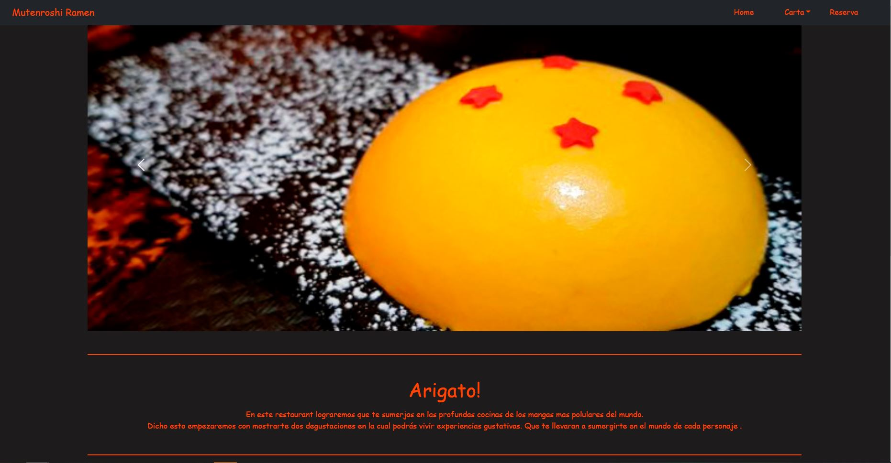
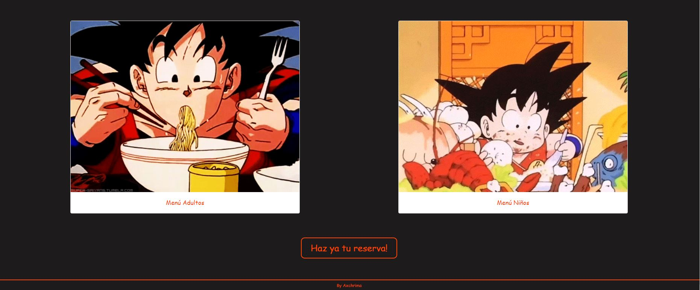
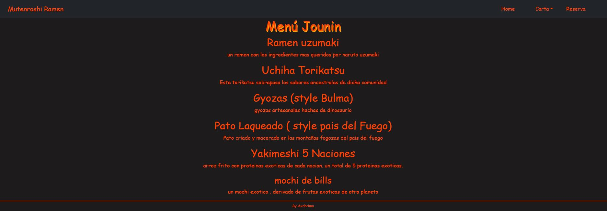
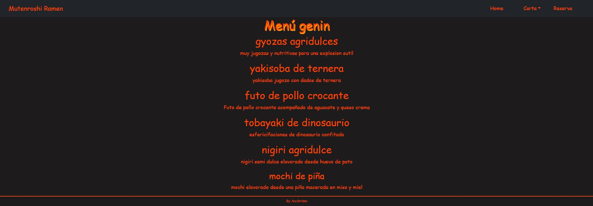
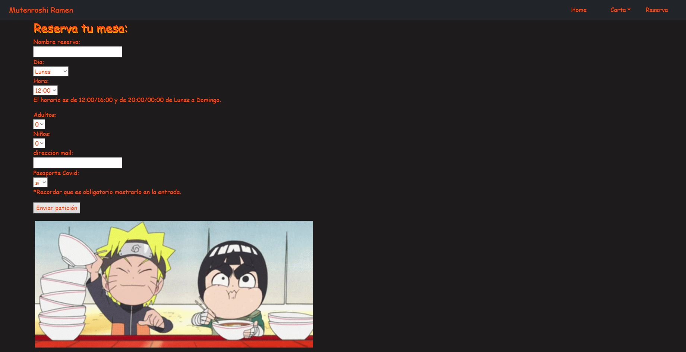
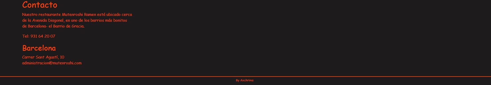

[Acceder al proyecto](https://manelus.github.io/Proyecto-carta-restaurante/)

<h5 style= color:orangered>Integrantes del grupo:</h5>

Manel Barreda, Christian Ochoa, Axel Urizar

<h1 align='center' style= color:orangered>Proyecto carta restaurante</h1>

Hemos desarrollado la página web de un restaurante con su página principal, su apartado de la carta tanto para adultos como para menores y un apartado para reservar mesa en nuestro restaurante.

<h2  style= color:orangered>Tecnologías usadas</h2>
<h3 align='center'>  HTML5</h3>
<h3 align= 'center'> CSS3</h3>
<h3 align='center'> Bootstrap5</h3>

<h2 style= color:orangered>Acercamiento</h2>

A la hora de desarrollar este proyecto comenzamos por darle forma sobre papel, ideando cuantas páginas nos gustaria tener en total, el diseño de estas, los colores a usar, etc.

Una vez de acuerdo dimos inicio al proyecto repartiendo cada pagina para uno de nosotros con tal de más tarde juntarlas y ajustar los estilos antes pactados.

<h2 style= color:orangered>Apartados de la página</h2>

<h3 align='center'  style= color:orangered>Inicio</h3>

A la hora de comenzar con la página principal nos encontramos con varios retos como la creación de la barra de navegación que terminariamos por deshechar y tomariamos una de las barras que bootstrap nos ofrecia en su página adecuandola a nuestras necesidades al igual que con el slider que hay justo tras ella. Tras terminarla decidimos dar una pequeña explicación sobre el propósito del restaurante para después dar paso a las cartas que creamos mediante el tag "Card" de Bootstrap5.

<h3 align='center' style= color:orangered>Carta</h3>

<h4 align='center' style= color:orangered>(Menú Adultos)</h4>

<h4 align='center' style= color:orangered>(Menú Niños)</h4>

Aprovechamos el hecho de que los menús tanto de adultos como de niños tendrian una estructura parecida para así aprovecharlo y ahorrar trabajo ya que solo debiamos crear una de ellas desde cero. Hicimos lo mismo con la barra de navegación usando la misma para las cuatro páginas.

<h3 align='center' style= color:orangered>Haz tu reserva!</h3>

En el apartado de la reserva utilizamos lo conocimientos sobre formularios que adquirimos durante el curso para que así el visitante pudiese darnos toda la información necesitada en la reserva añadiendo tambien una zona de contacto en la que se muestra la ubicación de nuestro restaurante así como el número telefónico en caso de que sea necesario llamar para esclarecer alguna duda

